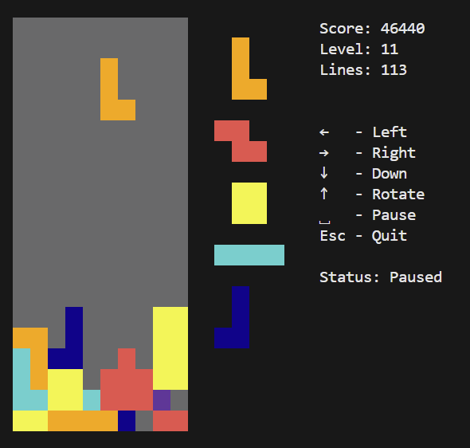

# tetris
A just for fun Tetris game written in Go.

The game currently supports a console UI to be run in a terminal.
The UI is abstracted behind a custom interface, so in future it may be possible to plug additional UIs into the same game logic. Possibly a windowed UI or a web UI.

To run the game, use the `mage run` command.

Non Mage users can build and run the game with:
```bash
go build -o tetris ./cmd
./tetris
```

Enjoy :)


